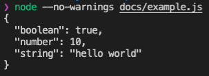

# inspect

Convert a value into a readable string.

[](https://github.com/jsenv/jsenv-inspect/packages)
[](https://www.npmjs.com/package/@jsenv/inspect)
[](https://github.com/jsenv/jsenv-inspect/actions?workflow=ci)
[](https://codecov.io/gh/jsenv/jsenv-inspect)

# Table of contents

- [Presentation](#Presentation)
- [Installation](#Installation)
- [Documentation](#Documentation)

# Presentation

`@jsenv/inspect` turns a JavaScript value into a string meant to be read by a human.

```js
import { inspect } from "../index.js"

console.log(
  inspect({
    boolean: true,
    number: 10,
    string: "hello world",
  }),
)
```



Inspect is alsmot equivalent to JSON.stringify

```js
const inspect = (value) => JSON.stringify(value, null, "  ")
```

The difference is that inspect handle values that JSON.stringify does not and focuses on readability.

```js
JSON.stringify(Infinity) // "null"
JSON.stringify(-0) // "0"

inspect(Infinity) // "Infinity"
inspect(-0) // "-0"
```

# Installation

```console
npm install @jsenv/inspect@1.3.1
```

# Documentation

Live browser example: https://jsenv.github.io/jsenv-inspect/#browser-example.

Live node example: https://jsenv.github.io/jsenv-inspect/#node-example
